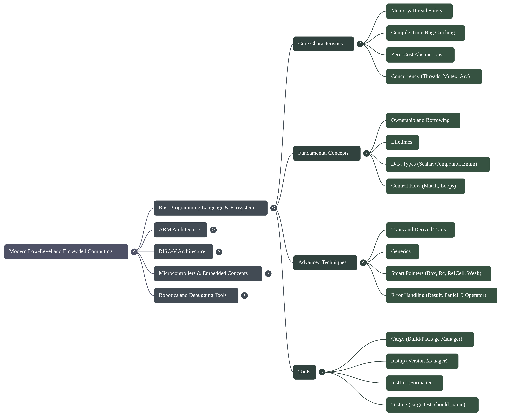
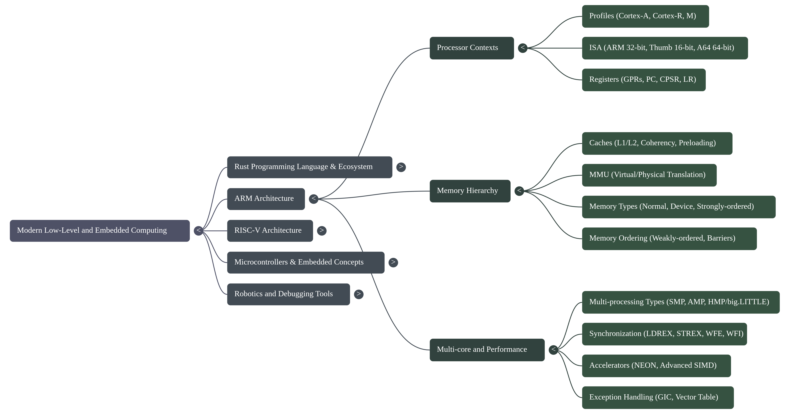
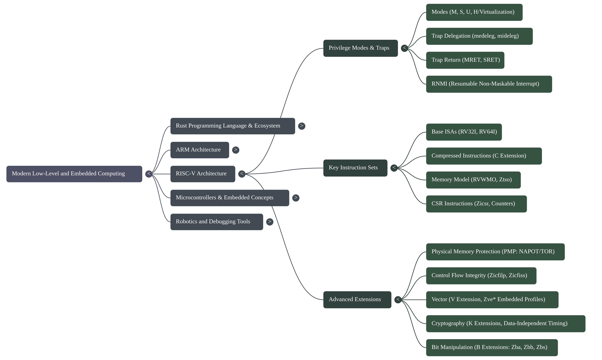
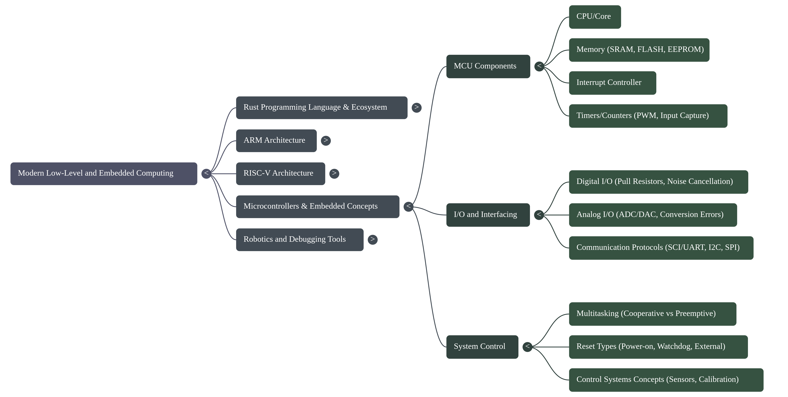
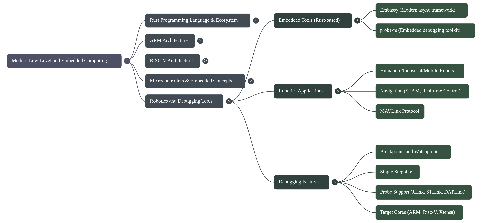

# Technical Report: The Modern Embedded Systems Paradigm

## 1. Executive Summary

Modern embedded systems development is strained by a fundamental tension: while
hardware complexity explodes, the traditional C/C++ development paradigm offers
insufficient compile-time guarantees against critical memory and concurrency failures.
A fundamental paradigm shift is underway to address this, moving away from legacy
approaches toward a powerful synergy between advanced hardware architectures and
modern, memory-safe programming languages. This shift is defined by the adoption of
high-performance languages like Rust, known for its core tenets of building reliable
and efficient software, in concert with sophisticated processor architectures such as
ARM and RISC-V.

Frameworks like Embassy are emerging to leverage this new paradigm, enabling
developers to write safe, correct, and energy-efficient embedded code using Rust's
advanced async capabilities. The strategic application of these modern language
features provides compile-time guarantees against entire classes of common and
dangerous bugs, such as memory errors and data races, which have historically
plagued embedded development.

This report analyzes the core technical pillars that underpin this modern paradigm:
foundational safety, hardware abstraction, performance optimization, and the
developer ecosystem. It will deconstruct the implementation methodologies that bring
these pillars to life and examine the inherent challenges and limitations that
engineers must navigate in this demanding field.

## 2. Core Technical Pillars

The modern embedded paradigm is built upon several foundational technical pillars that
collectively address the core challenges of safety, abstraction, and performance. This
new model does not treat these concerns as separate; instead, it integrates them
through a combination of language design, hardware architecture, and a robust
developer ecosystem. This section deconstructs these essential pillars.

### 2.1 Pillar 1: Foundational Safety and Reliability

In embedded systems—where software failure can lead to equipment damage or risk to
human life—memory and concurrency safety are paramount. The adoption of modern
languages is driven by the ability to provide these safety guarantees without
sacrificing performance. Rust, in particular, provides these guarantees at compile
time, eliminating entire classes of bugs before the code is ever deployed to a device.

* **Memory Safety**: Rust's ownership and borrowing model is a cornerstone of its
    safety guarantees. It enforces strict rules at compile time that ensure there is
    only one owner of a piece of data, preventing common errors like dangling
    pointers, buffer overflows, and use-after-free vulnerabilities. Crucially, this
    is achieved without a garbage collector, making it perfectly suited for
    resource-constrained, systems-level work where deterministic performance is
    essential.
* **Thread Safety**: With the rise of multi-core processors in embedded systems,
    managing concurrency safely is critical. Rust's type system extends its
    ownership model to multithreading, preventing data races at compile time. This
    compile-time guarantee is a revolutionary departure from traditional approaches
    that rely on runtime detection or developer discipline, which are inadequate for
    the complex Symmetric Multi-Processing (SMP) systems now common in embedded
    applications.
* **Robust Error Handling**: Traditional error handling, often relying on null
    pointers or error codes, can be easily overlooked by developers. Rust uses a
    `Result<T, E>` enum, which forces the developer to explicitly handle the
    possibility of failure. This ensures that errors are acknowledged and managed,
    leading to more robust and predictable software.

### 2.2 Pillar 2: Abstraction and Direct Hardware Control

Embedded systems engineering presents a unique duality: developers need high-level
abstractions to manage complexity, but also require direct, low-level control over
the underlying hardware. The modern paradigm addresses this by providing tools that
can operate at both levels of abstraction, built upon a deep understanding of the
hardware components.

-_**Microcontroller Architecture**: A microcontroller (MCU) is a self-contained
    computer on a single chip, designed for control tasks. It integrates a processor
    core (CPU), memory, I/O peripherals, timers, and an interrupt controller. This
    integration allows it to operate stand-alone, directly interfacing with its
    environment through general-purpose I/O pins.
-_**Processor Cores**: The dominant architectures in this space are ARM and RISC-V.
    Both are based on Reduced Instruction Set Computer (RISC) principles and are
    load/store architectures, meaning that arithmetic and logic instructions operate
    on registers, and only specific load and store instructions access memory. The
    ARM architecture is further divided into profiles tailored for different
    applications, such as the Cortex-A series for high-performance applications and
    the Cortex-R series for real-time systems. These cores can operate in different
    execution states, such as the 32-bit AArch32 or the 64-bit AArch64 state. This
    profile-based specialization allows hardware to be precisely tailored to an
    application's cost, power, and performance envelope, ranging from
    high-throughput application processors to fault-tolerant, deterministic
    real-time controllers.
-_**Memory Systems**: Embedded systems utilize a hierarchy of memory types. This
    includes fast but volatile Static RAM (SRAM) for data, and non-volatile Flash
    or EEPROM for program code and constants. High-performance systems, particularly
    in the real-time Cortex-R family, also feature Tightly Coupled Memory (TCM) for
    deterministic, low-latency access—a critical feature for hard real-time tasks
    where the non-deterministic latency of cache hierarchies is unacceptable. More
    complex Cortex-A processors include multi-level caches (L1/L2) and a Memory
    Management Unit (MMU) to translate virtual addresses generated by the core into
    physical memory addresses.
-_**Peripherals and Communication**: Software must directly control a wide range of
    on-chip peripherals to interact with the outside world. Common peripherals
    include General-Purpose Input/Output (GPIO) pins, Pulse Width Modulation (PWM)
    for controlling motors, and Analog-to-Digital Converters (ADC) for reading
    sensors. Communication is handled via standard protocols like I2C, SPI, and
    UART.

### 2.3 Pillar 3: Performance and Optimization

Performance and energy efficiency are non-negotiable requirements in most embedded
applications, from battery-powered IoT devices to real-time robotics controllers.
The modern paradigm achieves high performance through a combination of efficient
hardware features and software abstractions that compile down to optimized machine
code.

-_**Instruction Set Architecture (ISA)**: The RISC principles underlying both ARM
    and RISC-V contribute to efficient execution. ISAs are designed for optimal
    performance and code density. For example, the ARM architecture includes the
    32-bit ARM instruction set and the more compact 16/32-bit Thumb instruction set
    to reduce memory footprint. The A64 instruction set provides a clean,
    fixed-length instruction set for 64-bit computing.
-_**Advanced SIMD and Vector Processing**: Modern embedded processors feature
    powerful Single Instruction, Multiple Data (SIMD) capabilities to accelerate
    operations on large datasets. ARM's NEON technology and the RISC-V Vector ("V")
    extension allow a single instruction to perform an operation on multiple data
    points simultaneously. This is highly effective for tasks like media codecs,
    digital signal processing, and the matrix multiplication routines common in
    robotics and machine learning.
-_**Software Abstractions**: Modern languages like Rust provide "zero-cost
    abstractions," allowing developers to write high-level, expressive code that
    compiles down to machine code as fast as manually written low-level code.
    Features like async programming, central to frameworks like Embassy, enable the
    creation of highly concurrent applications that are also energy-efficient by
    allowing tasks to yield control and the processor to enter low-power sleep
    states while awaiting I/O events, a stark contrast to the power-inefficient
    busy-waiting or thread-based context switching required by traditional blocking
    models.

### 2.4 Pillar 4: A Modern Developer Ecosystem

Developer productivity and code quality are heavily influenced by the toolchain. The
modern embedded paradigm is supported by a comprehensive and integrated ecosystem of
tools that streamline the entire development lifecycle, from project creation to
on-target debugging.

-_**Project Management & Build System**: Rust's build system and package manager,
    Cargo, automates many of the most tedious development tasks. It handles
    downloading library dependencies, compiling code, running tests, and building
    the final binary, providing a consistent and reproducible build process for any
    project.
-_**Code Quality and Formatting**: To ensure code consistency across teams and
    projects, tools like `rustfmt` automatically format Rust code according to a
    standard style. This eliminates debates over formatting and allows developers to
    focus on the logic of their applications.
-_**Debugging and Flashing**: Modern debugging tool-sets like `probe-rs` provide a
    unified interface for on-chip debugging. Written in Rust, `probe-rs` can
    connect to a wide variety of debug probes and interface with both ARM and RISC-V
    cores. Its capabilities include reading and writing memory, halting and stepping
    through code, managing breakpoints, and flashing binaries to the target device.
    This toolkit provides a modern, unified software interface to the low-level
    debug hardware, such as JTAG and SWD interfaces, that are physically present on
    the microcontrollers.

## 3. Methodologies and Implementation

The practical implementation of this paradigm hinges on methodologies that skillfully
combine Rust's high-level features with direct hardware control. Developers write
expressive and safe application logic using a rich feature set, while simultaneously
employing sophisticated optimization and debugging techniques to create robust and
efficient applications.

-_**Leveraging High-Level Language Features**: The methodology hinges on the
    strategic application of Rust's features to solve long-standing embedded
    problems. The `async/.await` syntax, central to frameworks like Embassy, is used
    to build highly concurrent applications that are efficient and easier to reason
    about than traditional callback-based or threaded models. Traits are used to
    create powerful abstractions, while the `Result<T,E>` enum and the `?` operator
    provide a clean and robust mechanism for propagating and handling errors.
-_**Interfacing with Hardware**: Direct hardware control is fundamental to embedded
    programming. This involves writing to specific memory-mapped registers to
    configure and control peripherals like GPIOs and timers. Interrupts, which
    signal events from hardware, are handled by writing Interrupt Service Routines
    (ISRs) that execute when an event occurs. These low-level operations are
    combined with higher-level multitasking concepts to manage the overall system
    behavior.
-_**Applying Performance Optimization**: To meet strict performance targets,
    developers explicitly leverage advanced hardware features. For computationally
    intensive tasks like matrix multiplication, NEON intrinsics are used to issue
    SIMD instructions directly from high-level code. While the source example
    demonstrates this technique in C, Rust provides equivalent access to these
    low-level hardware capabilities. Achieving maximum performance often requires
    careful data layout, such as de-interleaving data structures to ensure that
    related data is contiguous in memory for vector processing. Compilers are guided
    using specific flags (e.g., `-mcpu` to target a specific core, `-mfpu` to enable
    floating-point hardware) to generate the most optimized code for the target
    hardware.
-_**Debugging and Verification**: The debugging workflow is streamlined by modern
    tools. A developer uses `probe-rs`, either through its command-line interface or
    a VS Code extension, to flash new firmware onto a target microcontroller. From
    there, they can perform standard debugging tasks such as setting breakpoints,
    stepping through code instruction-by-instruction, and inspecting memory and
    variable states. In addition to on-target debugging, Rust's built-in testing
    framework (`cargo test`) enables developers to write and run unit tests for
    business logic, ensuring correctness before deployment to hardware.

## 4. Challenges and Limitations

Despite the significant advancements offered by the modern paradigm, developing for
embedded systems involves navigating inherent complexities, trade-offs, and
limitations. The tight coupling of software with hardware means that developers must
contend with issues that are abstracted away in higher-level application
development.

-_**Inherent Hardware Complexity**: Modern processors, while powerful, introduce
    low-level complexities that software must manage. For instance, many ARM cores
    have a weakly-ordered memory model, meaning that memory operations can be
    reordered by the hardware. To ensure correctness, for instance when
    synchronizing with a peripheral or another core, developers must insert explicit
    memory barrier instructions (like the Data Synchronization Barrier, DSB) to
    enforce a specific order of memory operations. In multi-core systems,
    maintaining cache coherency—ensuring all cores have a consistent view of
    memory—is a significant and complex challenge.
-_**Resource Constraints**: Embedded systems are defined by their constraints. They
    operate with limited memory (SRAM and Flash), tight power consumption budgets,
    and finite processing power. These constraints dictate every aspect of software
    design, from the choice of algorithms and data structures to the implementation
    style, forcing a constant focus on efficiency.
-_**Tooling and Abstraction Gaps**: Even modern tools have limitations. For
    example, `rustfmt` is an excellent code formatter but cannot handle every
    possible edge case in Rust's syntax. Furthermore, educational materials often
    deliberately avoid deep, complex topics like linker scripts—which control how
    compiled code is laid out in memory—because they remain a significant hurdle for
    many developers, indicating a gap in user-friendly abstraction.
-_**Cross-Platform Portability**: Writing portable embedded software is a
    non-trivial task. Porting code between different processor architectures
    requires careful management of endianness (the byte order of data in memory),
    instruction set differences, and assumptions about memory ordering models. Code
    that works correctly on one platform may fail subtly on another if these details
    are not properly handled.
-_**Developer Learning Curve**: The powerful features of modern systems and
    languages come with a corresponding learning curve. Rust, in particular, is
    known for its steep initial learning curve, as developers must internalize the
    rules of its ownership and borrow checking system. While this system is the
    source of Rust's safety guarantees, it represents a significant conceptual shift
    for programmers accustomed to other languages.

## 5. Conclusion

This report has analyzed the paradigm shift in modern embedded systems, characterized
by the powerful synergy between the compile-time safety guarantees of Rust and the
advanced computational capabilities of ARM and RISC-V hardware. The paradigm shift
is therefore not merely an adoption of new tools, but a fundamental re-design
of the developer's relationship with the hardware. It replaces a paradigm of manual,
error-prone memory management and concurrency control with one where safety
guarantees are an automated, architectural first principle.

This shift is critical, as it is the primary enabler for reliably building the
complex, multi-core, and safety-critical systems that define the next generation of
embedded computing. It allows engineers to develop increasingly sophisticated
systems—from low-power microcontrollers to complex robotics platforms—with a higher
degree of confidence in their correctness and reliability. While significant
challenges related to hardware complexity and resource constraints remain, the
maturing ecosystem is making this power more accessible. Frameworks like Embassy
provide high-level abstractions for concurrency, while toolchains like probe-rs
unify and simplify the critical process of on-target debugging.

Looking forward, the continued convergence of software safety and hardware
performance promises to further accelerate innovation. As these tools and
methodologies become more widespread, engineers are better equipped to build the next
generation of intelligent, reliable, and efficient embedded systems that are
foundational to our technological world.
