# Mathematics for Autonomous Systems

This section is intended for robotics engineers and software developers
requiring a rigorous framework for autonomous behavior. The following modules
cover the core disciplines of Dynamical Systems, Linear Algebra, and Lie Theory,
alongside modern approaches in Optimization and Machine Learning. This
curriculum establishes the formal language necessary to model physical
constraints and manage environmental uncertainty. Mastery of these subjects
is a prerequisite for designing and implementing high-performance algorithms
for perception, estimation, and real-time motion planning.

```mermaid
%% TITLE: FIGURE 1: Simplified Robotics Domain Map
graph LR
%% Define Node Styles
classDef subject fill:#000000,stroke:#333,stroke-width:2px,rx:5,ry:5,color:#fff;
classDef hub fill:#212121,stroke:#000,stroke-width:3px,rx:10,ry:10,font-weight:bold;

%% 1. The Math Basics
subgraph Foundations
    DS[Dynamical Systems]:::subject
    LS[Linear Systems]:::subject
    PROB[Probability]:::subject
    NUM[Numerical Methods]:::subject
end

%% 2. The Advanced Toolset
subgraph Advanced Topics
    OPT[Optimization]:::subject
    LIE[Lie Theory]:::subject
    ML[Machine Learning]:::subject
end

%% 3. The Robotic Capabilities
subgraph Applications
    EST(Estimation):::hub
    PLAN(Planning):::hub
    PERC(Perception):::hub
    DEC(Decision Making):::hub
end

```

## Outline

### Dynamical Systems

> Linear and nonlinear ordinary differential equations; Initial Value Problems
> and numerical integration; Phase Portraits and Equilibrium points; Laplace and
> Z-transforms; Transfer Functions; effects of poles and zeros on frequency, and
> stability analysis.

Systems theory provides the mathematical infrastructure for modeling and
analyzing systems.

- **Inverted Pendulum Simulation**: Derive the equations of motion using
  Lagrangian mechanics and simulate the nonlinear system. Linearize around the
  upright/downright equilibrium points to analyze their stability.
- **Robot Chassis Simulation**: Develop a mobile robot chassis model. Start with
  known constraints (size, weight,...) and then design the parameters of the
  motors and wheels.
- **Frequency Response Analysis**: Tune a generic 2nd order transfer function to
  fit the bode plot of an "unknown" system.

### Linear Systems

> Vector spaces and norms; matrices and linear transformations; rank, nullity,
> and the four fundamental subspaces; eigenvalues and eigenvectors;
> diagonalization and Jordan normal form; orthogonality and projections;
> least-squares fitting; determinants and inverses; QR, SVD, and LU
> decompositions; condition numbers and numerical stability.

Nearly every algorithm in robotics reduces to a linear algebra operation. You
cannot design a Kalman filter, invert kinematics, optimize trajectories, or
compress data without it.

- **Camera Calibration**: Recover intrinsic and extrinsic parameters from
  checkerboard images via least-squares regression.
- **Dynamic Mode Decomposition**: Recover the discrete linear dynamics of a
  system by exciting it and measuring the states.
- **Hardware Optimized BLAS**: Implement a custom matrix multiplication function
  that utilizes a SIMD or NEON hardware feature. Use this function to simulate
  and analyze a system. Examine the precision and performance between a naive
  gemm function and a parallelized one.

### Probability and Information Theory

> Probability axioms and rules; conditional probability and Bayes' rule; random
> variables and distributions (Gaussian, exponential, Laplace); expectation,
> variance, and covariance; independence and conditional independence; entropy
> and mutual information; relative entropy (KL divergence); Fisher information
> and the Cramér-Rao bound; parameter estimation (maximum likelihood, MAP);
> Bayes filters and recursive estimation; Kalman filters and Extended Kalman
> Filters; particle filters and Monte Carlo localization.

You cannot fuse sensor data, estimate hidden states, or make principled
decisions under uncertainty without probability theory. It is essential for
perception, localization, and planning in the real world.

- **Monte Carlo localization**: Implement a particle filter for a mobile robot
  in a known map with laser rangefinder and odometry.
- **Kalman Filter for Inertial Measurement**: Fuse accelerometer and gyroscope
  data to estimate 3D orientation with explicit covariance propagation.
- **GPS/Odometry Fusion for Localization**: Implement an Extended Kalman Filter
  (EKF) to fuse noisy GPS measurements with wheel odometry data for robust 2D
  pose estimation of a mobile robot, including covariance management and outlier
  rejection.

### Numerical Methods

> Root-finding (bisection, Newton-Raphson, secant method); linear system solvers
> (Gaussian elimination, iterative methods); eigenvalue computation (power
> iteration, QR algorithm); numerical integration of ODEs (Euler, RK2, RK4,
> symplectic integrators); error analysis and convergence rates; stability of
> difference equations; stiffness and implicit methods; constraint handling
> (penalty methods, Lagrange multipliers); numerical optimization (line search,
> trust regions, Hessian approximation).

This topic relates advanced linear algebra tools and computer architecture.

- **Satellite Orbit Simulation**: Integrate rigid-body dynamics (nonlinear ODEs)
  forward in time to predict motion, using RK4 or symplectic integrators for
  energy stability.
- **Manipulator Pose Planning**: Iteratively solve a nonlinear system
  (Newton-Raphson) to find joint angles that achieve a desired end-effector
  pose.

### Lie Theory

> Lie groups and Lie algebras; SO(3) and SE(3); exponential and logarithmic
> maps; tangent spaces and differential; geodesics and geodesic distance;
> quaternions and their relationship to SO(3); adjoint representations;
> perturbation analysis; manifold optimization; numerical integration on
> manifolds.

Ad-hoc use of Euler angles will lead to singularities and numerical instability.
Proper use of Lie groups ensures your rotation computations are
singularity-free, differentiable, and efficient.

- **Spherical Linear Interpolation (SLERP)**: Interpolate between two 3D
  rotations via the geodesic in SO(3), preserving angular velocity.
- **Kinematic Control on SO(3)**: Implement an attitude feedback controller
  (3-loop autopilot, PID, LQR) to stabilize a quadcopter's attitude.
- **Manifold Sampling for Motion Planning**: Generate collision-free
  configurations sampling directly on SE(3), avoiding singularities.

### Optimization

> Unconstrained optimization (gradient descent, Newton's method, quasi-Newton
> methods, line search, trust regions); convex optimization (convex sets and
> functions, duality, KKT conditions); constrained optimization (Lagrange
> multipliers, penalty and augmented Lagrangian methods); linear programming;
> quadratic programming; semidefinite programming; sequential convex
> programming; gradient-free methods (genetic algorithms, simulated annealing);
> convergence analysis and rates.

You'll spend most of your time formulating problems and choosing solvers.
Understanding convexity, duality, and KKT conditions helps you recognize
solvable problems and detect non-convexity before wasting compute on bad local
minima.

- **Trajectory Optimization**: Design a transfer orbit for a satellite to change
  its orbit altitude. Assume an ideal elliptical orbit at both altitudes, the
  input is the current orbit, target orbit and the output is the transfer path
  (plus entry/exit points).
- **Physics Informed Neural Network**: Use a neural network to solve partial
  differential equations by embedding the physics equations as a regularization
  term in the loss function.

### Machine Learning

> Linear and polynomial regression; regularization (L1, L2); classification
> (logistic regression, SVMs, decision trees); neural networks and
> backpropagation; convolutional and recurrent architectures; unsupervised
> learning (k-means, GMM, PCA); dimensionality reduction (t-SNE, auto-encoders);
> clustering; Bayesian inference and expectation-maximization; reinforcement
> learning (Markov decision processes, value iteration, policy gradient); model
> evaluation and validation.

Modern perception (object detection, pose estimation, semantic segmentation)
relies entirely on learned models. Data-driven control and planning are
increasingly competitive with classical methods.

- **Object Detection and 6D Pose**: Fine-tune a CNN for detecting objects and
  regressing their 3D pose from RGB-D images for robotic grasping.
- **Dynamics Model Learning**: Learn a forward model (state + action → next
  state) from robot trajectories to enable black box model-based planning and
  control.
- **Reinforcement Learning for Navigation**: Train a policy via deep Q-learning
  or policy gradients to navigate a mobile robot to a goal while avoiding
  obstacles.

---
